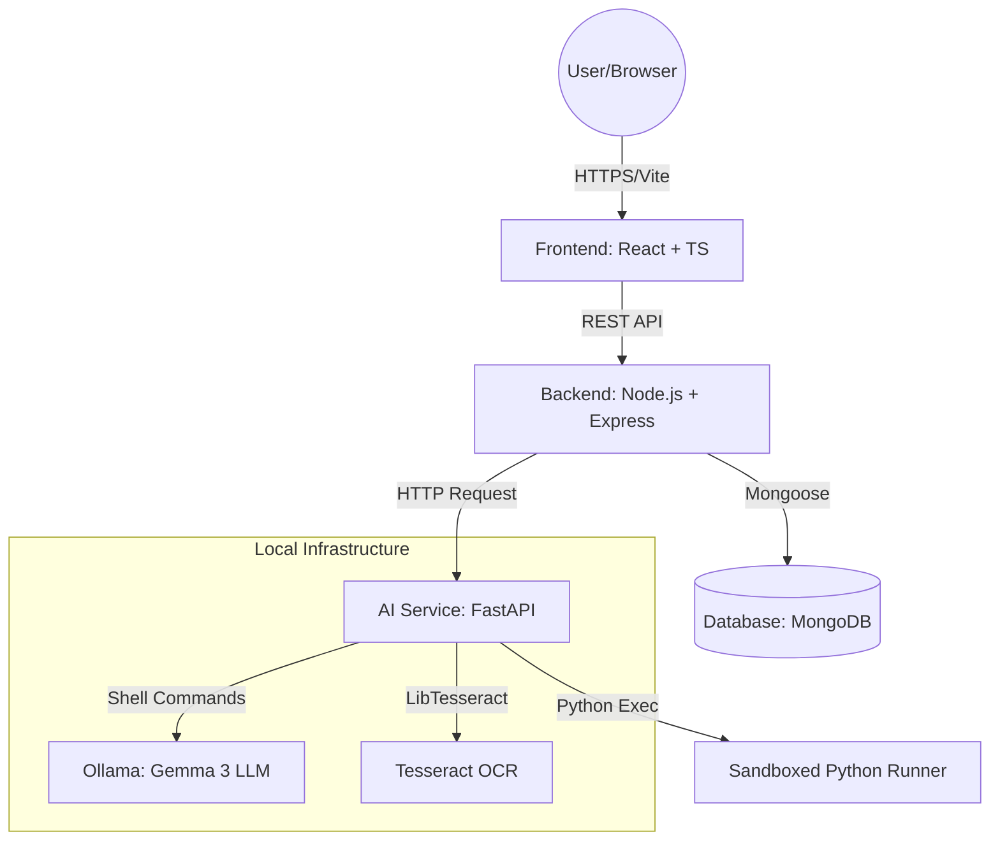
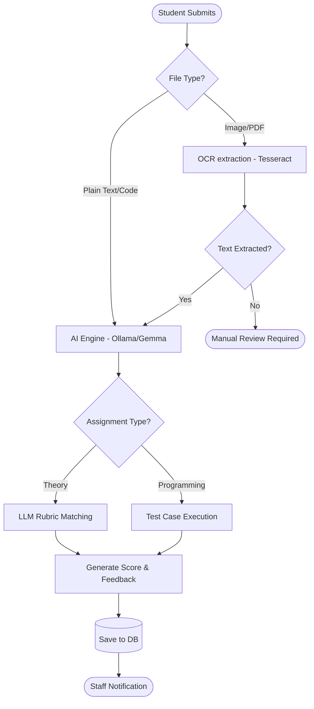
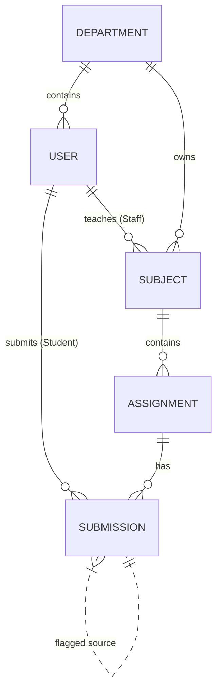

# AAES - Comprehensive Project Documentation

## 1. Introduction
The **Automated Assignment Evaluation System (AAES)** is an AI-powered academic platform designed to streamline the assignment lifecycle. It leverages OCR, Large Language Models (LLM), and automated code execution to provide instant feedback and analytics for students, staff, and administrators.

---

## 2. System Architecture
AAES uses a modular micro-services-inspired architecture to separate concerns between frontend, backend, and AI processing.



---

## 3. Detailed Data Models (Schema)

### 3.1 User Model (`User.js`)
Stores authentication, profile, and academic hierarchy data.
- **Identity**: `username`, `email`, `password` (hashed).
- **Profile**: `fullName`, `phone`, `profileImage`, `bloodGroup`, `currentCgpa`.
- **Academic Hierarchy**:
    - `role`: enum [`admin`, `hod`, `staff`, `student`, `principal`]
    - `department`, `academicYear`, `semester`, `batch`, `section`.
    - `classAdvisor`: Ref to User (Staff).
    - `mentor`: Ref to User (Staff) - 1-to-1 mapping.
- **Preferences**: Theme, notification toggles (Email/In-App).

### 3.2 Assignment Model (`Assignment.js`)
Defines the task created by staff for students.
- **Metadata**: `title`, `description`, `maxMarks`, `deadline`.
- **Context**: `subject` (Ref), `department`, `semester`, `section`.
- **Submission Type**: enum [`handwritten`, `document`, `ppt`, `quiz`, `code`, `seminar`].
- **Format Configuration**: `Mixed` type for variant data (e.g., hidden test cases for `code`, options for `quiz`).

### 3.3 Submission Model (`Submission.js`)
Tracks student attempts and AI evaluation results.
- **References**: `student`, `assignment`.
- **Content**: `code` (string), `fileUrl` (string), `answers` (string).
- **Grading**: `marks`, `status`, `feedback`, `isLocked`.
- **AI Analytics**:
    - `plagiarismScore`: % similarity with other submissions.
    - `aiAnalysis`: Clarity, Relevance, and Completeness scores.
    - `testCaseResults`: For programming (Input/Output/Passed).
    - `needsManualReview`: Flagged if AI confidence is low.

---

## 4. API Documentation (REST Endpoints)

### 🔐 Authentication (`/api/auth`)
| Method | Endpoint | Access | Description |
| :--- | :--- | :--- | :--- |
| POST | `/login` | Public | Authenticates user and returns JWT |
| GET | `/me` | Private | Returns current user profile |

### � Assignments (`/api/assignments`)
| Method | Endpoint | Access | Description |
| :--- | :--- | :--- | :--- |
| POST | `/` | Staff | Create new assignment with format config |
| GET | `/` | All | Get assignments (filtered by subjectId query) |
| GET | `/student` | Student | Get assignments enrolled for current student |
| GET | `/my-created` | Staff | Get assignments created by current faculty |
| GET | `/:id/gradebook` | Staff/HOD | Consolidated student marks for an assignment |
| DELETE | `/:id` | Staff/Admin | Remove assignment and all related submissions |

### 📤 Submissions (`/api/submissions`)
| Method | Endpoint | Access | Description |
| :--- | :--- | :--- | :--- |
| POST | `/` | Student | Submit assignment (supports files via Multer) |
| GET | `/my` | Student | View own submission history |
| GET | `/assignment/:id`| Staff | View all submissions for a specific task |
| PUT | `/:id/grade` | Staff | Manually override or update AI marks |
| PUT | `/:id/lock` | Staff | Lock marks to prevent further changes |
| PUT | `/:id/unlock` | HOD | Permission-based mark unlocking |

---

## 5. Feature Deep-Dive

### 👨‍💼 Role Capabilities
- **Admin**: Bulk upload students using standardized CSV templates. Manages department metadata.
- **HOD**: Departmental dashboard showing consolidated "Consolidated Reports". Can unlock locked marks.
- **Staff**: "Evaluation" tab displays AI-suggested marks vs. manual options. Mentorship module tracks 1-to-1 mentee progress.
- **Student**: "AI Study Assistant" allows querying PDFs using RAG (Retrieval-Augmented Generation) logic.

### 🛡️ Security & Middleware
1. **JWT Auth**: Every request (except login) requires a `Bearer` token.
2. **Access Control**: Role-based authorization (`authorize('staff', 'hod')`) ensures data isolation.
3. **Sandboxing**: Programming assignments run student code in a separate process with a 5-second timeout and blocked system calls (like `os.remove`).

---

## 6. Workflows & Sequence Diagrams

### 6.1 Assignment Evaluation Flow


### 6.2 Database Entity Relationship


---

## 7. AI Logic & Prompt Engineering
The system uses a multi-stage prompt for theory evaluation:
1. **Context injection**: Assignment Question + Model Answer + Keywords.
2. **Student Input**: OCR-cleaned text.
3. **Rubric Constraints**: Explicitly instructs LLM to check Relevance, Correctness, and Completeness.
4. **Format Restriction**: Forces JSON output `{ "score": X, "feedback": "Y" }`.

```python
# snippet from python_service/main.py
prompt = f"""
You are a strict academic grading engine.
Maximum Marks: {max_marks}
Keywords: {keywords}
...
Return strictly in this format:
{{ "score": 0, "feedback": "" }}
"""
```

---

## 9. Specialized Modules (Deep Dives)
## 9. Specialized Documentation (Deep Dives)
For granular details on specific sub-systems or presentation materials, please refer to:
- **[AAES_PPT_CONTENT.md](./AAES_PPT_CONTENT.md)**: Copy-paste ready slides for project presentations.
- **[CCM_DETAILS.md](./CCM_DETAILS.md)**: Class Committee Meeting workflows, action items, and student representation.
- **[MENTOR_DETAILS.md](./MENTOR_DETAILS.md)**: Mentorship queries, interaction tracking, and student risk assessment.

---

## 10. Installation
Detailed setup in [README.md](./README.md).
