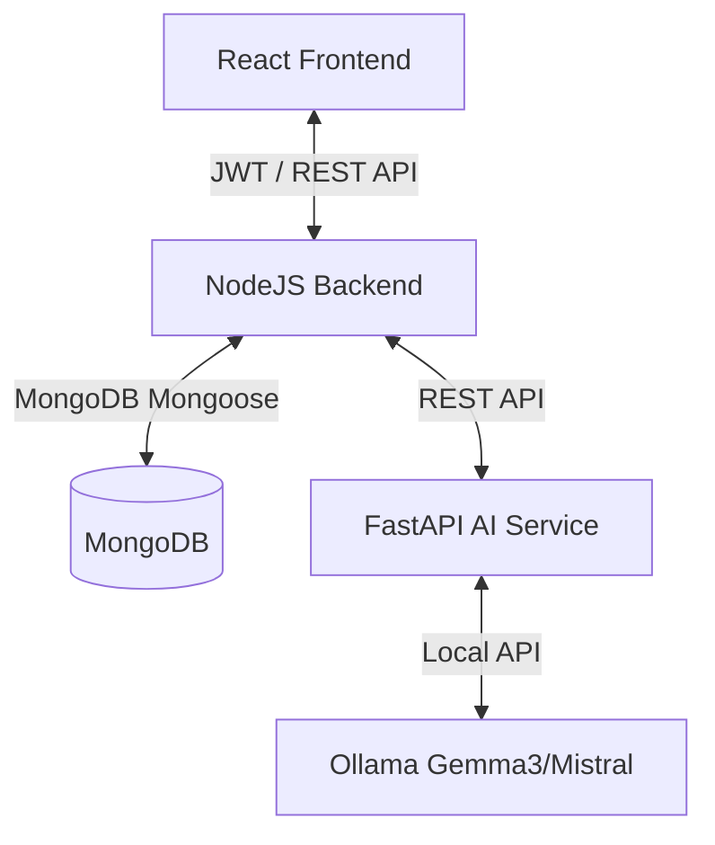

# AAES - Automated Academic Evaluation System


[](https://github.com/Prakash-Ramakrishnan110/AAES-Project.git)

> An AI-powered, end-to-end automated assignment evaluation system designed for academic environments. Featuring intelligent grading, OCR handwriting recognition, semantic plagiarism checks, role-based dashboards, and comprehensive student performance analytics.

---

## 🌟 Key Features

### 🎓 For Students
- **Coursework View:** View active assignments tailored to enrollment parameters (department, semester, academic year).
- **Submissions Hub:** Submit text or file attachments (PDFs, Python scripts, images) for evaluation.
- **Notes AI Assistant:** Dynamic RAG (Retrieval-Augmented Generation) assistant to query uploaded lecture notes and study guides.
- **Grades & Feedback:** Receive instant grades, detailed logic breakdowns, and personalized conceptual feedback.

### 👩‍🏫 For Staff
- **Assignment Creator:** Set up Python programming tasks (with dynamic unit test checks) or theory questions.
- **Evaluation Desk:** Access AI-generated grading, verify plagiarism scores, review alternate challenges (identity verification), or overwrite marks manually.
- **Lecture Notes Portal:** Upload course notes to dynamically train the subject-level Notes AI Assistant.
- **Class Analytics:** Monitor average marks, grade distributions, and concept gaps within the student cohort.

### 🏛️ For HODs & Admins
- **Department Governance:** Scoped access to departmental staff, students, and subjects.
- **Bulk Import Engine:** Import student and staff cohorts via CSV files.
- **System Metrics:** Real-time diagnostics monitoring MongoDB, server memory, CPU load, and AI Engine health.
- **Transition Control:** Semester-wide student batch promotions.

---

## ⚙️ Architecture & Tech Stack

The platform is structured as a decoupled 3-tier microservice architecture:
- **Frontend:** React, TypeScript, Tailwind CSS, Vite, and Lucide React.
- **Core Backend:** Node.js, Express, MongoDB (Mongoose), JWT, and Multer.
- **Intelligence Service (AI):** Python, FastAPI, PaddleOCR, EasyOCR, SentenceTransformers (all-MiniLM-L6-v2), and local LLM integrations (Ollama).



---

## 🚀 Installation & Setup

### Prerequisites
- [Node.js](https://nodejs.org/) (v18+)
- [MongoDB](https://www.mongodb.com/) (running locally or a connection string)
- [Python](https://www.python.org/) (3.10+)
- [Ollama](https://ollama.com/) (with `gemma3:1b` and `mistral:latest` models pulled)

### 1. Database Setup
Ensure MongoDB is running locally. You can use MongoDB Compass to manage it.
```bash
# Verify connection
mongosh --eval "db.adminCommand('ping')"
```

### 2. Core Backend Setup
```bash
cd backend
npm install
# Rename .env.example to .env and configure variables
npm run dev
```

Create a `.env` file in the `backend` directory:
```env
MONGODB_URI=mongodb://localhost:27017/aaes
PORT=5000
JWT_SECRET=your_secure_secret_key
PYTHON_SERVICE_URL=http://127.0.0.1:8000
```

### 3. FastAPI AI Engine Setup
Ensure you have virtualenv installed, then set up the workspace:
```bash
# Inside the root directory
python -m venv .venv
.venv\Scripts\activate
cd ai_service
pip install -r requirements.txt
python main.py
```
*Note: The AI engine will spin up on `http://127.0.0.1:8000`.*

Ensure the required models are downloaded in Ollama:
```bash
ollama pull gemma3:1b
ollama pull mistral:latest
```

### 4. React Frontend Setup
```bash
cd frontend
npm install
npm run dev
```
*Access the student/staff dashboards at `http://localhost:3051`.*

---

## ⚙️ Unified Startup

For easy execution, you can run the unified startup script from the root folder:
```cmd
# Windows Batch System Setup
start.bat
```
*This script will open MongoDB Compass, launch the Node.js backend, start the Vite frontend, run the FastAPI AI service, and launch the dashboard web views in Chrome.*

---

## 🔒 Security & Integrity

- **Dangerous Command Interceptors:** Automated Python grading sandbox inspects files for harmful imports/commands (`os.system`, `subprocess`, file writing outside temp directories, etc.) prior to execution.
- **Identity Verification alternate challenges:** If the AI flags a student's submission with low confidence or possible plagiarism, it triggers a "challenge questions" cycle to verify their conceptual understanding.
- **CORS & Rate Limiter:** Backend utilizes Express Rate Limiters and Helmet to secure APIs against payload abuse.

---

## 👨‍💻 Author

**Prakash Ramakrishnan**  
- **GitHub:** [@Prakash-Ramakrishnan110](https://github.com/Prakash-Ramakrishnan110)
- **Repo:** [AAES Project](https://github.com/Prakash-Ramakrishnan110/AAES-Project.git)

---
Made with ❤️ for automated academic excellence.
